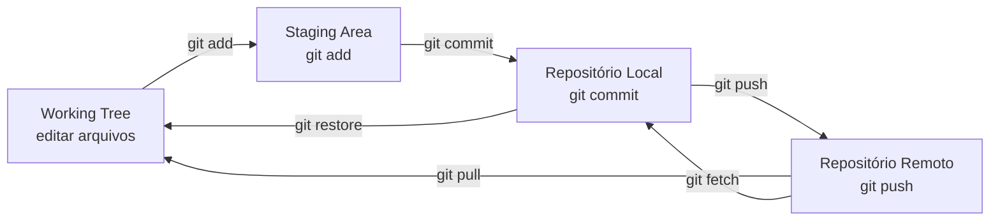
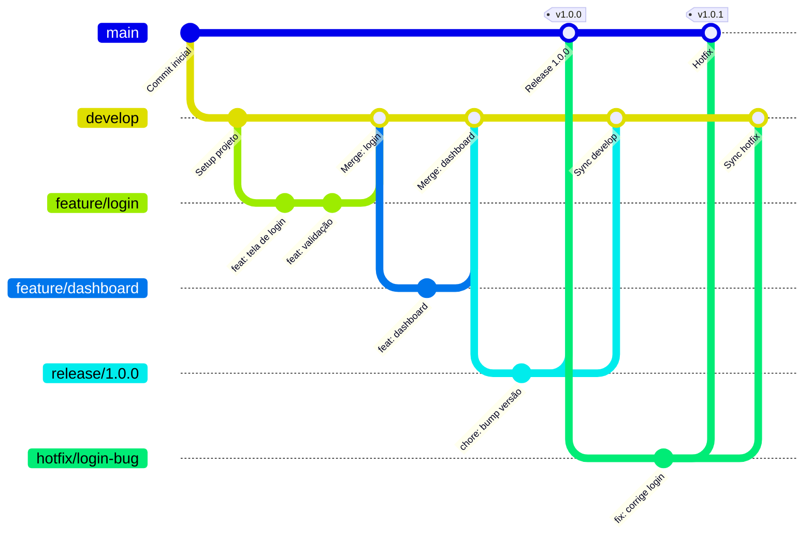
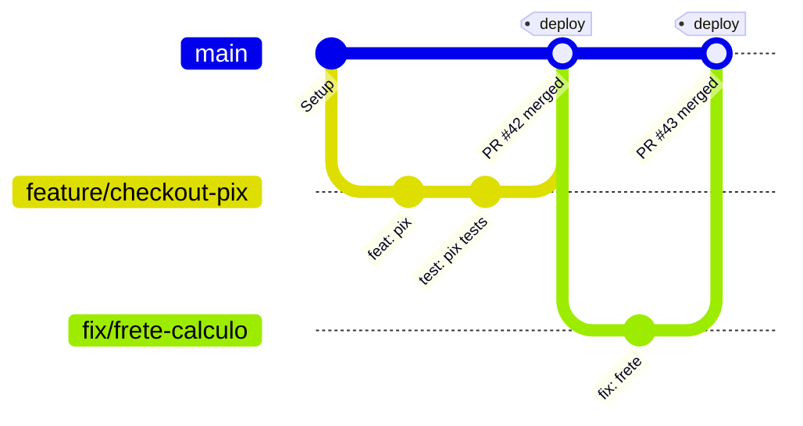
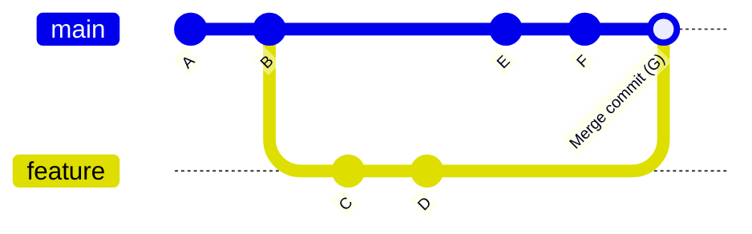
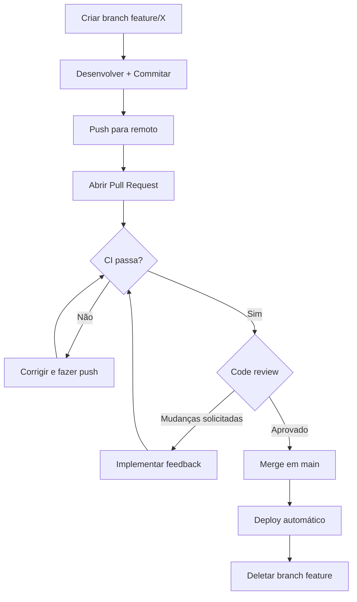
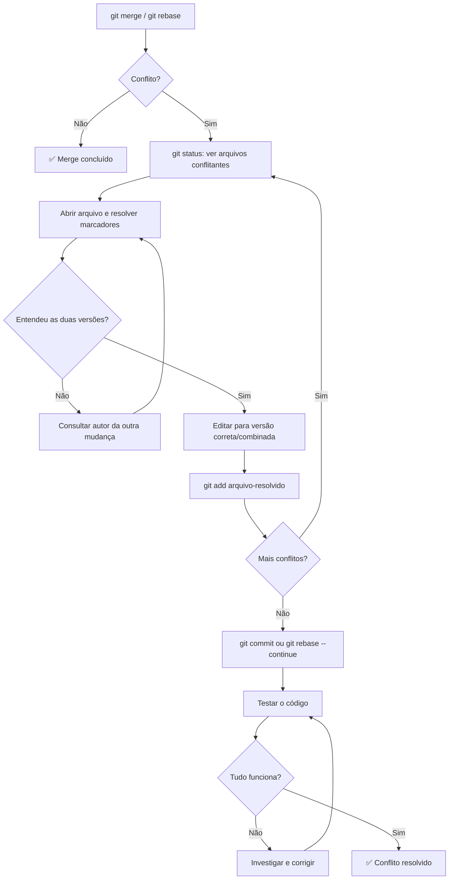
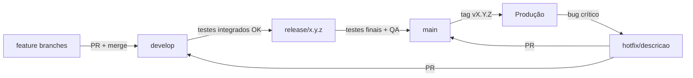

# Git: Do Zero à Excelência para Times de Desenvolvimento

> Guia mestre prático para equipes desenvolvendo projetos web complexos.  
> Versão 1.0 — Abril 2026

---

## Índice

1. [Resumo Executivo](#1-resumo-executivo)
2. [Fundamentos do Git](#2-fundamentos-do-git)
3. [Roteiro de Aprendizado Passo a Passo](#3-roteiro-de-aprendizado-passo-a-passo)
4. [Mega-Cheatsheet de Comandos](#4-mega-cheatsheet-de-comandos)
5. [Estratégias de Branching](#5-estratégias-de-branching)
6. [Merge vs Rebase](#6-merge-vs-rebase)
7. [Colaboração em Equipe](#7-colaboração-em-equipe)
8. [Resolução de Conflitos](#8-resolução-de-conflitos)
9. [Reverter, Resetar e Recuperar](#9-reverter-resetar-e-recuperar)
10. [Workflows Remotos: GitHub, GitLab e Bitbucket](#10-workflows-remotos-github-gitlab-e-bitbucket)
11. [Políticas de Branching e Governança](#11-políticas-de-branching-e-governança)
12. [Git Hooks, Aliases e Automações](#12-git-hooks-aliases-e-automações)
13. [Submódulos e Subtrees](#13-submódulos-e-subtrees)
14. [CI/CD e Git](#14-cicd-e-git)
15. [Plano de Migração](#15-plano-de-migração)
16. [Exemplos de Workflows Reais](#16-exemplos-de-workflows-reais)
17. [Diagramas Mermaid](#17-diagramas-mermaid)
18. [Recursos e Referências Oficiais](#18-recursos-e-referências-oficiais)

---

## 1. Resumo Executivo

### O que é Git

Git é um sistema de controle de versão distribuído. Ele registra o histórico completo de mudanças em arquivos ao longo do tempo, permitindo que múltiplas pessoas trabalhem simultaneamente no mesmo código sem destruir o trabalho umas das outras.

Não é um sistema de backup. Não é só "salvar versões". É uma ferramenta de colaboração e rastreabilidade que, quando bem usada, transforma a forma como um time trabalha.

### Por que Git é essencial em equipes

- Múltiplos desenvolvedores mexem no mesmo código ao mesmo tempo sem colisão.
- Qualquer mudança pode ser rastreada: quem fez, quando, por quê.
- É possível voltar a qualquer ponto do histórico sem perder trabalho recente.
- Permite experimentar com total segurança via branches.
- É o padrão de mercado absoluto — praticamente todo time de desenvolvimento usa Git.

### Os maiores erros de iniciantes

| Erro | Consequência |
|---|---|
| Commitar direto na branch principal | Quebra o trabalho dos outros, dificulta revisão |
| Commits grandes e sem contexto | Histórico ilegível, impossível reverter mudanças isoladas |
| Não puxar mudanças antes de trabalhar | Conflitos desnecessários e acúmulo de divergência |
| Usar `git push --force` sem entender | Apaga o trabalho de outros no repositório remoto |
| Nunca usar branches | Elimina o maior benefício do Git |
| Ignorar conflitos ou resolver mal | Código quebrado em produção |
| Commitar arquivos sensíveis (senhas, chaves) | Falha de segurança gravíssima, mesmo depois de deletar |

### Abordagem recomendada para um site complexo em equipe

Para um site complexo com múltiplos desenvolvedores, a recomendação é:

1. **Estratégia de branches**: GitHub Flow com variações (simples, eficaz, fácil de aprender).
2. **Convenção de commits**: Conventional Commits (padroniza mensagens e habilita automação).
3. **Pull Requests obrigatórios**: nenhum código entra na branch principal sem revisão.
4. **CI/CD integrado**: testes automáticos em cada PR.
5. **Proteção de branch**: bloqueio de push direto na `main`.

Se o time for grande (10+ devs) ou tiver ciclos de release definidos, considerar Git Flow ou Trunk-based Development.

### O que você vai conseguir fazer ao final

- Usar Git com confiança no dia a dia.
- Trabalhar em equipe sem medo de conflitos.
- Entender e escolher estratégias de branching adequadas.
- Configurar proteções e automações em repositórios.
- Recuperar trabalho perdido e reverter erros com segurança.
- Integrar Git com pipelines de CI/CD.
- Tomar decisões de plataforma (GitHub, GitLab, Bitbucket) com critério.

---

## 2. Fundamentos do Git

### O que é versionamento

Versionamento é o processo de registrar mudanças em arquivos ao longo do tempo de forma estruturada. Sem um sistema de versionamento, o controle de versões é manual: `site_v1.html`, `site_v2_final.html`, `site_v2_final_MESMO.html`. Isso é inviável em equipe.

Um sistema de controle de versão (VCS) registra automaticamente cada estado do projeto, quem o alterou, quando e por quê — e permite navegar entre esses estados com precisão.

### Git vs Plataformas (GitHub, GitLab, Bitbucket)

Essa distinção é crítica e frequentemente confundida por iniciantes.

| Conceito | O que é |
|---|---|
| **Git** | Software local de controle de versão. Roda na sua máquina. Open source. |
| **GitHub** | Plataforma web que hospeda repositórios Git. Adiciona pull requests, issues, Actions, etc. |
| **GitLab** | Plataforma similar ao GitHub, com foco em CI/CD integrado. Pode ser auto-hospedada. |
| **Bitbucket** | Plataforma da Atlassian. Integra bem com Jira e Confluence. |

**Git existe sem GitHub. GitHub não existe sem Git.**

Você pode usar Git localmente sem nunca conectar a nenhuma plataforma. As plataformas adicionam colaboração remota, interface web, automações e integrações.

### Como o Git pensa o histórico

O Git não armazena "diferenças entre arquivos" como muitas pessoas imaginam. Ele armazena **snapshots** — fotografias completas do estado do projeto em um dado momento.

Cada snapshot é um **commit**. Cada commit aponta para o commit anterior, formando uma cadeia. Essa cadeia é o histórico.

**Componentes fundamentais:**

- **Working tree (árvore de trabalho)**: os arquivos que você edita localmente. O estado atual do seu disco.
- **Staging area (índice)**: área intermediária onde você prepara as mudanças antes de commitar. Pense como uma "mesa de seleção" — você escolhe o que vai entrar no próximo commit.
- **Repositório local (`.git/`)**: pasta oculta que contém todo o histórico, commits, branches e objetos do Git.
- **HEAD**: ponteiro que indica onde você está no histórico. Normalmente aponta para o commit mais recente da branch atual.
- **Branch**: ponteiro móvel para um commit. Quando você cria um novo commit, a branch avança automaticamente.
- **Commit**: snapshot permanente do projeto, identificado por um hash SHA-1 único (ex: `a3f2c9d`).

**Analogia útil**: pense no Git como uma linha do tempo de fotografias do seu projeto. Cada commit é uma foto. Uma branch é um marcador que aponta para uma foto específica. HEAD é o "você agora" — a foto que está vendo. Fazer um commit é tirar uma nova foto e mover o marcador para ela.

```
Working Tree  →  Staging Area  →  Repositório Local  →  Repositório Remoto
  (editar)         (git add)         (git commit)          (git push)
```

### Repositório local vs remoto

- **Local**: existe só na sua máquina. Você pode fazer commits, branches e histórico completo sem internet.
- **Remoto**: repositório hospedado em um servidor (GitHub, GitLab, etc.) que serve como ponto central de sincronização entre o time.

Você conecta os dois com `git remote add origin <url>`. A partir daí, `push` envia seus commits para o remoto, e `pull`/`fetch` traz os commits do remoto para você.

### Forks, clones, upstream, origin

| Termo | Significado |
|---|---|
| **clone** | Copia um repositório remoto para a sua máquina localmente |
| **fork** | Cria uma cópia de um repositório remoto para a sua conta (em plataformas como GitHub) |
| **origin** | Nome padrão para o repositório remoto de onde você clonou |
| **upstream** | Nome convencional para o repositório original quando você trabalha com um fork |

**Exemplo prático:**
```
Repositório original: github.com/empresa/projeto  → upstream
Seu fork:             github.com/voce/projeto      → origin
Sua máquina local:    ~/projetos/projeto           → (local)
```

### O fluxo básico

```bash
# 1. Editar arquivos
nano index.html

# 2. Ver o que mudou
git status

# 3. Preparar para commit (staging)
git add index.html
# ou adicionar tudo:
git add .

# 4. Commitar com mensagem
git commit -m "feat: adiciona seção de contato na home"

# 5. Enviar para o remoto
git push origin main

# 6. Puxar mudanças do remoto
git pull origin main

# 7. Buscar mudanças sem aplicar (apenas ver)
git fetch origin
```

**Diferença entre `pull` e `fetch`:**
- `fetch`: busca as mudanças do remoto e armazena localmente, **mas não aplica** no seu código.
- `pull`: faz `fetch` + `merge` (ou `rebase`) automaticamente. Aplica as mudanças.

Use `fetch` quando quiser ver o que mudou antes de decidir aplicar. Use `pull` quando quiser sincronizar diretamente.

---

## 3. Roteiro de Aprendizado Passo a Passo

### Etapa 1 — Iniciação local

**Objetivo**: Configurar o Git, criar seu primeiro repositório e fazer commits básicos.

**Exercícios práticos:**

```bash
# Configuração inicial (faça isso uma vez)
git config --global user.name "Seu Nome"
git config --global user.email "seu@email.com"
git config --global core.editor "code --wait"  # VS Code como editor padrão
git config --global init.defaultBranch main

# Criar repositório
mkdir meu-projeto && cd meu-projeto
git init

# Criar arquivo e fazer primeiro commit
echo "# Meu Projeto" > README.md
git add README.md
git commit -m "chore: commit inicial"

# Ver histórico
git log --oneline
```

**Checkpoint:**
- [ ] Consegue criar um repositório do zero.
- [ ] Consegue fazer `add` e `commit`.
- [ ] Entende o que aparece em `git status`.
- [ ] Consegue ler `git log`.

**Erros comuns nessa fase:**
- Esquecer de configurar `user.name` e `user.email` → commits ficam sem identificação.
- Usar `git add .` sem entender o que está adicionando → commita arquivos indesejados.
- Commitar a pasta `.git/` ou arquivos de sistema → configure `.gitignore` desde o início.

**Critério para avançar**: Fez pelo menos 5 commits em um projeto local com mensagens coerentes.

---

### Etapa 2 — Commits bem feitos

**Objetivo**: Aprender a escrever commits que comunicam intenção, não apenas "o que mudou".

**Por que isso importa:**
Um commit bom é uma unidade atômica de mudança com contexto claro. Um commit ruim é uma bagunça que ninguém entende seis meses depois.

**Padrão recomendado: Conventional Commits**

```
<tipo>(<escopo opcional>): <descrição curta>

[corpo opcional]

[rodapé opcional]
```

**Tipos principais:**
- `feat`: nova funcionalidade
- `fix`: correção de bug
- `docs`: mudança em documentação
- `style`: formatação (sem mudança de lógica)
- `refactor`: refatoração sem nova funcionalidade nem bug fix
- `test`: adição ou correção de testes
- `chore`: tarefas de manutenção, configs, build

**Exemplos:**

```bash
# Bom
git commit -m "feat(auth): implementa login com Google OAuth"
git commit -m "fix(cart): corrige cálculo de frete para CEPs do Nordeste"
git commit -m "docs: atualiza README com instruções de instalação"

# Ruim
git commit -m "ajustes"
git commit -m "fix"
git commit -m "wip"
git commit -m "arrumei umas coisas"
```

**Regras de ouro:**
1. Assunto com no máximo 72 caracteres.
2. Use o imperativo: "adiciona", "corrige", "remove" — não "adicionei", "corrigido".
3. Não termine com ponto final.
4. Corpo explica o **porquê**, não o **o quê** (o `diff` já mostra o quê).

**Checkpoint:**
- [ ] Entende o padrão Conventional Commits.
- [ ] Consegue identificar um commit ruim e reescrevê-lo.
- [ ] Usa `git commit --amend` para corrigir o último commit (sem ter feito push).

**Critério para avançar**: Consegue justificar a mensagem de cada commit que faz.

---

### Etapa 3 — Branches locais

**Objetivo**: Trabalhar com branches para isolar desenvolvimento de features.

```bash
# Criar e mudar para nova branch
git switch -c feature/pagina-sobre

# Ver branches existentes
git branch

# Trabalhar normalmente
echo "Sobre nós" > sobre.html
git add sobre.html
git commit -m "feat: cria página sobre"

# Voltar para main
git switch main

# Mergear a branch
git merge feature/pagina-sobre

# Deletar branch após merge
git branch -d feature/pagina-sobre
```

**Nomenclatura de branches recomendada:**

```
feature/nome-da-funcionalidade
fix/descricao-do-bug
hotfix/problema-critico
release/1.2.0
chore/atualiza-dependencias
docs/melhora-readme
```

**Checkpoint:**
- [ ] Cria, usa e deleta branches locais.
- [ ] Entende que `main` não deve receber commits diretos em projeto de equipe.
- [ ] Consegue fazer merge simples (sem conflito).

---

### Etapa 4 — Stash

**Objetivo**: Guardar trabalho temporariamente sem commitar.

O stash é útil quando você precisa trocar de contexto urgentemente mas não quer commitar um trabalho incompleto.

```bash
# Você está no meio de uma feature e precisa urgentemente trocar de branch
git stash push -m "wip: implementando filtro de produtos"

# Trocar de branch, resolver o problema
git switch hotfix/login-quebrado
# ... faz os ajustes ...
git switch feature/filtro-produtos

# Recuperar o trabalho guardado
git stash pop

# Ver o que tem no stash
git stash list

# Aplicar um stash específico sem removê-lo
git stash apply stash@{2}

# Descartar um stash
git stash drop stash@{0}
```

**Atenção:** O stash não é um substituto de commits. Não use stash como "área de backup" permanente. Stashes são temporários e podem ser perdidos.

---

### Etapa 5 — Tags

**Objetivo**: Marcar pontos específicos no histórico (releases, versões).

```bash
# Tag anotada (recomendada para releases)
git tag -a v1.0.0 -m "Release versão 1.0.0"

# Tag leve (apenas um ponteiro)
git tag v1.0.0-beta

# Listar tags
git tag

# Enviar tags para o remoto
git push origin v1.0.0
git push origin --tags  # todas de uma vez

# Ver detalhes de uma tag
git show v1.0.0

# Deletar tag local
git tag -d v1.0.0

# Deletar tag remota
git push origin --delete v1.0.0
```

**Use versionamento semântico (SemVer):** `MAJOR.MINOR.PATCH`
- `MAJOR`: mudança incompatível com versão anterior.
- `MINOR`: nova funcionalidade compatível.
- `PATCH`: correção de bug compatível.

---

### Etapa 6 — Merge e Rebase

_(Detalhado no capítulo 6. Aqui, o essencial para avançar no roteiro.)_

```bash
# Merge: integra duas branches preservando o histórico completo
git switch main
git merge feature/login

# Rebase: reaplica commits de uma branch sobre outra (reescreve histórico)
git switch feature/login
git rebase main
```

**Regra prática para iniciantes:**
- Use `merge` para integrar branches à `main`.
- Use `rebase` para atualizar sua branch de feature com as mudanças da `main` **antes** de abrir PR.
- **Nunca rebase em branches públicas/compartilhadas** sem entender as consequências.

---

### Etapa 7 — Colaboração via Pull Request / Merge Request

**Objetivo**: Trabalhar no fluxo real de equipe com revisão de código.

```bash
# Fluxo completo
git switch main
git pull origin main                        # garante que está atualizado
git switch -c feature/checkout-pix         # cria branch a partir da main atualizada

# ... desenvolve ...
git add .
git commit -m "feat(checkout): adiciona pagamento via Pix"

git push origin feature/checkout-pix       # envia para o remoto
# Abre Pull Request na interface do GitHub/GitLab/Bitbucket
# Aguarda revisão e aprovação
# Merge feito pela plataforma
```

---

### Etapa 8 — Resolução de Conflitos

_(Detalhado no capítulo 8.)_

**Checkpoint:**
- [ ] Sabe identificar um conflito pelos marcadores `<<<<<<<`, `=======`, `>>>>>>>`.
- [ ] Consegue resolver um conflito manualmente e commitar.
- [ ] Sabe usar `git merge --abort` para cancelar um merge problemático.

---

### Etapa 9 — Reversão e Recuperação

_(Detalhado no capítulo 9.)_

**Checkpoint:**
- [ ] Sabe a diferença entre `git revert` e `git reset`.
- [ ] Consegue recuperar commits "perdidos" com `git reflog`.
- [ ] Entende qual operação é segura em histórico público e qual não é.

---

### Etapa 10 — Fluxos reais em equipe e CI/CD

**Objetivo**: Participar de um projeto com pipelines, proteções e governança real.

**Marcos desta etapa:**
- Trabalha em branches de feature com nomes padronizados.
- Abre PRs com descrição adequada e checklist preenchido.
- Revisa PRs de colegas com critério técnico.
- Pipeline de CI passa antes do merge.
- Faz deploy via tag ou merge na `main`.

---

## 4. Mega-Cheatsheet de Comandos

### Configuração

| Comando | O que faz | Quando usar | Exemplo |
|---|---|---|---|
| `git config --global user.name "Nome"` | Define nome do usuário | Uma vez, ao instalar Git | `git config --global user.name "Ana Lima"` |
| `git config --global user.email "email"` | Define email do usuário | Uma vez, ao instalar Git | `git config --global user.email "ana@empresa.com"` |
| `git config --list` | Lista todas as configurações | Para verificar configuração atual | `git config --list` |
| `git config --global core.autocrlf input` | Normaliza quebras de linha | Em Linux/Mac para evitar problemas com Windows | — |

---

### Inicialização e Clonagem

```bash
# Iniciar repositório novo
git init
git init nome-da-pasta    # cria pasta e inicia

# Clonar repositório existente
git clone https://github.com/usuario/repo.git
git clone https://github.com/usuario/repo.git minha-pasta    # clona em pasta específica
git clone --depth 1 https://github.com/usuario/repo.git      # clone superficial (só o último commit)
```

**Erro comum:** Clonar dentro de uma pasta que já é um repositório Git. Sempre verifique com `git status` antes de clonar.

---

### Status e Diff

```bash
# Ver estado atual do repositório
git status
git status -s    # formato curto

# Ver diferenças entre working tree e staging
git diff

# Ver diferenças entre staging e último commit
git diff --staged
git diff --cached    # sinônimo de --staged

# Ver diferenças entre dois commits
git diff a3f2c9d 7b8e1f2

# Ver diferenças entre duas branches
git diff main feature/login

# Ver apenas os nomes dos arquivos modificados
git diff --name-only main feature/login
```

---

### Staging e Commit

```bash
# Adicionar arquivos ao staging
git add arquivo.html
git add pasta/
git add .                          # adiciona tudo (use com atenção)
git add -p                         # modo interativo: escolhe partes do arquivo

# Remover arquivo do staging sem perder mudanças
git restore --staged arquivo.html  # Git moderno
git reset HEAD arquivo.html        # Git antigo (também funciona)

# Commitar
git commit -m "feat: mensagem clara"
git commit                         # abre editor para mensagem longa
git commit --amend                 # modifica o último commit (não publicado)
git commit --amend --no-edit       # amend sem mudar mensagem

# Commitar direto sem staging (apenas arquivos já rastreados)
git commit -am "fix: corrige validação do formulário"
```

**⚠️ Alerta:** `git commit --amend` reescreve o histórico. Nunca use em commits já enviados para repositório compartilhado.

---

### Histórico

```bash
# Log padrão
git log

# Log compacto
git log --oneline

# Log com grafo de branches
git log --oneline --graph --all

# Log de um arquivo específico
git log -- src/auth.js

# Log com diff de cada commit
git log -p

# Log dos últimos N commits
git log -5

# Buscar commits por mensagem
git log --grep="login"

# Log por autor
git log --author="Ana"

# Log entre datas
git log --after="2024-01-01" --before="2024-06-01"
```

---

### Branches

```bash
# Listar branches locais
git branch

# Listar branches remotas
git branch -r

# Listar todas (locais + remotas)
git branch -a

# Criar branch
git branch nome-da-branch

# Criar e mudar para branch (forma moderna, recomendada)
git switch -c nome-da-branch

# Criar branch a partir de um commit específico
git switch -c hotfix/login-quebrado a3f2c9d

# Mudar de branch
git switch main

# Renomear branch atual
git branch -m novo-nome

# Deletar branch (só se já foi mergeada)
git branch -d feature/login

# Deletar branch forçado (mesmo sem merge)
git branch -D feature/abandonada

# Deletar branch remota
git push origin --delete feature/login

# Publicar branch local no remoto
git push -u origin feature/login    # -u define o upstream, só precisa na primeira vez

# Criar branch local rastreando remota
git switch --track origin/feature/login
```

---

### Merge

```bash
# Merge padrão (cria commit de merge)
git switch main
git merge feature/login

# Merge sem fast-forward (sempre cria commit de merge, mesmo quando desnecessário)
git merge --no-ff feature/login

# Squash merge (condensa todos os commits da branch em um)
git merge --squash feature/login
git commit -m "feat: implementa módulo de login"    # precisa commitar manualmente

# Abortar merge com conflito
git merge --abort

# Continuar merge após resolver conflitos
git merge --continue
```

**Quando usar `--no-ff`:** Em projetos que valorizam rastreabilidade por branch. O commit de merge deixa explícito que aquele grupo de commits veio de uma feature branch.

**Quando usar `--squash`:** Quando a branch de feature tem commits "WIP" e você quer manter o histórico da `main` limpo. Perda de rastreabilidade individual dos commits.

---

### Rebase

```bash
# Rebase simples
git switch feature/login
git rebase main

# Rebase interativo (reescreve histórico dos últimos N commits)
git rebase -i HEAD~3

# Rebase interativo a partir de um commit específico
git rebase -i a3f2c9d

# Continuar rebase após resolver conflitos
git rebase --continue

# Abortar rebase
git rebase --abort

# Pular um commit durante rebase (com cuidado)
git rebase --skip
```

**No rebase interativo, comandos disponíveis:**
- `pick`: usa o commit como está.
- `reword`: usa o commit mas edita a mensagem.
- `edit`: pausa para editar o commit.
- `squash`: combina com o commit anterior (mantém mensagens).
- `fixup`: combina com o commit anterior (descarta mensagem).
- `drop`: remove o commit.

**⚠️ Alerta máximo:** `git rebase` reescreve o histórico. Em branches locais não publicadas, é ótimo. Em branches públicas, é problemático — força `push --force`, podendo apagar trabalho dos outros.

---

### Stash

```bash
# Guardar mudanças (working tree + staging)
git stash push -m "wip: filtro de produtos"

# Guardar incluindo arquivos não rastreados
git stash push -u -m "wip: novos arquivos de componentes"

# Listar stashes
git stash list

# Aplicar o stash mais recente e removê-lo da lista
git stash pop

# Aplicar stash específico sem remover
git stash apply stash@{2}

# Ver o conteúdo de um stash
git stash show stash@{0} -p

# Criar branch a partir de um stash
git stash branch nome-da-branch stash@{0}

# Remover stash específico
git stash drop stash@{0}

# Limpar todos os stashes
git stash clear
```

---

### Tags

```bash
# Tag anotada (com metadados, recomendada para releases)
git tag -a v1.2.0 -m "Release 1.2.0: adiciona módulo de relatórios"

# Tag leve
git tag v1.2.0-rc1

# Listar tags
git tag
git tag -l "v1.*"    # filtra por padrão

# Ver detalhes
git show v1.2.0

# Push de tag específica
git push origin v1.2.0

# Push de todas as tags
git push origin --tags

# Deletar tag local
git tag -d v1.2.0-beta

# Deletar tag remota
git push origin --delete v1.2.0-beta
```

---

### Fetch, Pull, Push e Remote

```bash
# Gerenciar remotos
git remote -v                                    # listar remotos
git remote add origin https://github.com/u/r    # adicionar remoto
git remote remove origin                         # remover remoto
git remote rename origin novo-nome              # renomear remoto
git remote set-url origin https://nova-url      # mudar URL

# Fetch: baixa mudanças sem aplicar
git fetch origin
git fetch --all    # todos os remotos

# Pull: fetch + merge (ou rebase, se configurado)
git pull origin main
git pull --rebase origin main    # usa rebase em vez de merge

# Push: enviar commits ao remoto
git push origin feature/login
git push -u origin feature/login    # define upstream (primeira vez)
git push --all origin               # envia todas as branches

# Force push (⚠️ perigoso em branches compartilhadas)
git push --force origin feature/login
git push --force-with-lease origin feature/login    # mais seguro: verifica se houve push remoto
```

**`--force-with-lease` é sempre preferível a `--force`:** ele verifica se o remoto está no estado que você esperava antes de sobrescrever. Se alguém fez push enquanto você rebaseava, o `--force-with-lease` vai falhar (bom!) em vez de silenciosamente apagar o trabalho deles.

---

### Reset, Revert e Reflog

```bash
# Reset (move o HEAD para um commit anterior)
git reset --soft HEAD~1     # desfaz commit, mantém mudanças no staging
git reset --mixed HEAD~1    # desfaz commit, mantém mudanças na working tree (padrão)
git reset --hard HEAD~1     # desfaz commit E descarta mudanças (⚠️ irreversível sem reflog)

# Revert (cria novo commit que desfaz um commit anterior)
git revert HEAD              # reverte o último commit
git revert a3f2c9d           # reverte commit específico
git revert HEAD~3..HEAD      # reverte os últimos 3 commits

# Reflog: histórico de onde HEAD esteve
git reflog
git reflog show HEAD@{5}

# Recuperar commit "perdido" via reflog
git switch -c recuperacao HEAD@{3}
git reset --hard HEAD@{5}    # restaura estado específico
```

---

### Cherry-pick

```bash
# Copiar um commit específico para a branch atual
git cherry-pick a3f2c9d

# Cherry-pick múltiplos commits
git cherry-pick a3f2c9d 7b8e1f2

# Cherry-pick sem commitar (aplica mudanças no staging)
git cherry-pick -n a3f2c9d

# Continuar cherry-pick após resolver conflito
git cherry-pick --continue

# Abortar
git cherry-pick --abort
```

**Quando usar:** Quando precisa de um fix específico de outra branch sem trazer tudo dela. Exemplo clássico: um hotfix foi feito na branch de release e você precisa dessa correção na `main` também.

---

### Bisect

```bash
# Iniciar busca binária para achar commit que introduziu um bug
git bisect start
git bisect bad              # commit atual tem o bug
git bisect good v1.0.0     # essa versão estava boa

# Git vai pular para o meio do histórico
# Teste e marque:
git bisect good    # sem bug
git bisect bad     # com bug

# Repita até Git apontar o commit culpado
# Finalizar
git bisect reset
```

**Bisect é um dos comandos mais subestimados do Git.** Quando você tem centenas de commits entre "funcionava" e "quebrou", bisect encontra o culpado em O(log n) passos.

---

### Clean

```bash
# Ver o que seria deletado (dry-run, obrigatório antes de executar)
git clean -n
git clean -nd    # inclui diretórios

# Deletar arquivos não rastreados
git clean -f

# Deletar arquivos não rastreados e diretórios
git clean -fd

# Deletar também arquivos ignorados (.gitignore)
git clean -fdx
```

**⚠️ Alerta:** `git clean -fd` é irreversível. Os arquivos não vão para lixeira. Sempre faça `git clean -n` antes para confirmar o que vai ser deletado.

---

### Config e Aliases

```bash
# Configurações úteis
git config --global pull.rebase true          # pull usa rebase por padrão
git config --global push.autoSetupRemote true # push configura upstream automaticamente
git config --global merge.conflictstyle diff3 # mostra base nos conflitos (muito útil)
git config --global rerere.enabled true       # lembra resolução de conflitos

# Aliases úteis
git config --global alias.st status
git config --global alias.co "switch"
git config --global alias.br branch
git config --global alias.last "log -1 HEAD"
git config --global alias.lg "log --oneline --graph --all --decorate"
git config --global alias.unstage "restore --staged"
git config --global alias.undo "reset HEAD~1 --mixed"
git config --global alias.aliases "config --get-regexp alias"
```

---

### Submodule e Subtree

_(Detalhado no capítulo 13.)_

---

### .gitignore

```bash
# Arquivo .gitignore: lista padrões de arquivos a ignorar

# Exemplo para projeto web (Node.js + build)
node_modules/
dist/
build/
.env
.env.local
.env.*.local
*.log
.DS_Store
Thumbs.db
.vscode/settings.json  # apenas settings locais; pode versionar extensions.json
coverage/
.cache/
*.min.js.map

# Verificar por que um arquivo está sendo ignorado
git check-ignore -v arquivo.js

# Forçar adicionar arquivo ignorado (use com cuidado)
git add -f arquivo-ignorado.js

# Atualizar cache após mudar .gitignore (para arquivos já rastreados)
git rm --cached -r .
git add .
git commit -m "chore: atualiza regras de .gitignore"
```

**Nunca versione:** `node_modules/`, `.env` com secrets, arquivos de build, arquivos de SO (`.DS_Store`, `Thumbs.db`), configurações locais de IDE.

---

## 5. Estratégias de Branching

### Git Flow

Criado por Vincent Driessen em 2010. Usa duas branches permanentes (`main` e `develop`) e branches de suporte (`feature/`, `release/`, `hotfix/`).

**Fluxo:**
- Features partem de `develop` e voltam para `develop`.
- Quando pronto para release, cria-se `release/x.y.z` a partir de `develop`.
- A release é mergeada em `main` (com tag) e de volta em `develop`.
- Hotfixes partem de `main` e voltam para `main` e `develop`.

**Prós:**
- Separação clara entre desenvolvimento em andamento e produção.
- Suporta múltiplas versões em paralelo.
- Boa rastreabilidade de releases.

**Contras:**
- Complexo. Muitas branches, muitas regras.
- Conflitos frequentes em `develop` se o time for grande.
- Ciclos longos entre commit e produção.
- Dificulta CI/CD contínuo.

---

### GitHub Flow

Simples: só existe a branch `main` (produção) e branches de feature. Cada feature vai direto para `main` via PR.

**Fluxo:**
1. Cria branch a partir de `main`.
2. Desenvolve e commita.
3. Abre Pull Request.
4. Revisão e aprovação.
5. Merge em `main`.
6. Deploy automático.

**Prós:**
- Simples de aprender e executar.
- Ciclo curto entre feature e produção.
- Fácil de integrar com CI/CD.

**Contras:**
- Dificulta manutenção de múltiplas versões em produção.
- Exige maturidade em testes automáticos (tudo que vai para `main` vai para produção).

---

### Trunk-Based Development (TBD)

Todos os desenvolvedores integram à `main` várias vezes ao dia. Features incompletas são escondidas via feature flags.

**Prós:**
- Integração contínua real.
- Conflitos mínimos (mudanças pequenas e frequentes).
- Facilita deploy contínuo.

**Contras:**
- Exige disciplina, testes robustos e feature flags.
- Sem feature flags, código incompleto vai para produção.
- Pode ser difícil de adotar em times sem maturidade em testes.

---

### Tabela Comparativa

| Critério | Git Flow | GitHub Flow | Trunk-Based |
|---|---|---|---|
| **Complexidade** | Alta | Baixa | Média |
| **Velocidade de entrega** | Lenta | Alta | Muito alta |
| **Time pequeno (< 5)** | Excessivo | Ideal | Ótimo |
| **Time grande (> 15)** | Razoável | Adequado | Excelente |
| **Facilidade de CI/CD** | Difícil | Fácil | Muito fácil |
| **Risco de conflitos** | Alto | Médio | Baixo |
| **Múltiplas versões simultâneas** | Suportado | Difícil | Difícil |
| **Maturidade necessária** | Média | Baixa | Alta |
| **Feature flags necessárias** | Não | Não | Sim (idealmente) |

---

### Quando usar cada estratégia

**Use Git Flow quando:**
- Você mantém múltiplas versões do produto em produção simultaneamente.
- O ciclo de release é longo e formal (ex.: software embarcado, apps mobile com aprovação de loja).
- A equipe é grande e precisa de separação clara entre o que está pronto e o que está em desenvolvimento.

**Use GitHub Flow quando:**
- Você faz deploy frequente (diário ou mais).
- O time é pequeno a médio.
- Não há necessidade de manter múltiplas versões.
- Está começando a estruturar um processo — é o ponto de entrada ideal.

**Use Trunk-Based quando:**
- O time tem maturidade alta em testes automatizados.
- CI/CD está sólido.
- A velocidade de entrega é crítica.
- Você tem cultura de feature flags e deploy contínuo.

**Para um site complexo em equipe:** GitHub Flow é a recomendação de partida. Adicione uma branch `develop` se precisar de um ambiente de staging separado, e adote Git Flow somente se releases formais forem uma necessidade real — não por modismo.

---

## 6. Merge vs Rebase

### Diferença conceitual

**Merge** integra duas branches criando um commit de merge. O histórico preserva exatamente o que aconteceu, com todas as bifurcações e uniões.

**Rebase** reaplica os commits de uma branch sobre outra, como se eles tivessem sido criados a partir daquele ponto. O resultado é um histórico linear.

```
Antes do merge/rebase:
        A---B---C  feature
       /
D---E---F---G  main

Depois do merge:
        A---B---C
       /         \
D---E---F---G---H  main (H = commit de merge)

Depois do rebase (em feature):
                A'--B'--C'  feature
               /
D---E---F---G  main
```

### Tabela Comparativa

| Critério | Merge | Rebase |
|---|---|---|
| **Preserva histórico** | Sim, fielmente | Não, reescreve commits |
| **Histórico legível** | Pode ficar poluído com muitos merges | Mais linear e limpo |
| **Seguro em branch pública** | Sempre | Nunca (reescreve SHAs) |
| **Ideal para** | Integração final (PR → main) | Atualizar branch local com main |
| **Resolução de conflitos** | Uma vez, no commit de merge | Potencialmente em cada commit rebaseado |
| **Rastreabilidade por branch** | Explícita | Perdida |
| **Risco** | Baixo | Alto se mal aplicado |

### Quando usar merge

- Integrando uma branch de feature na `main` via PR.
- Quando você quer preservar exatamente quando e como as mudanças foram integradas.
- Em branches públicas/compartilhadas — sempre.

### Quando usar rebase

- Atualizando sua branch local de feature com as mudanças recentes da `main`.
- Limpando seu histórico local antes de abrir um PR (squash via rebase interativo).
- Em branches que **só você** usa.

### A regra de ouro do rebase

**Nunca rebase em commits que já foram publicados e que outros possam estar usando.**

Quando você rebaseia, o Git cria novos commits com novos hashes SHA-1. Se outra pessoa baixou os commits originais, ela agora tem uma linha do tempo incompatível com a sua. O resultado é caos: commits duplicados, conflitos inexplicáveis, histórico bifurcado.

### Exemplos práticos

```bash
# Cenário: você está em feature/login e a main avançou
# Use rebase para manter sua branch atualizada
git switch feature/login
git fetch origin
git rebase origin/main
# Resolve conflitos se houver, então:
git rebase --continue

# Depois do rebase, abra o PR ou faça merge
git switch main
git merge --no-ff feature/login  # merge simples, sem conflitos agora
```

```bash
# Limpar histórico antes do PR (rebase interativo)
git rebase -i HEAD~4
# Edite os últimos 4 commits: squash WIPs, melhore mensagens
```

---

## 7. Colaboração em Equipe

### Pull Requests / Merge Requests

PR (GitHub/Bitbucket) e MR (GitLab) são a mesma coisa com nomes diferentes. É o mecanismo pelo qual mudanças são propostas, revisadas e aceitas no repositório.

Um PR bem feito inclui:
1. **Título claro** seguindo a convenção de commits.
2. **Descrição** com contexto, motivação e o que foi feito.
3. **Screenshots ou vídeos** para mudanças visuais.
4. **Checklist** de revisão.
5. **Link para a issue ou task** relacionada.

### Template de Pull Request

```markdown
## O que esse PR faz?

Breve descrição do que foi implementado ou corrigido.

## Motivação

Por que essa mudança é necessária? Qual problema resolve?

## Como testar?

1. Acesse a página X
2. Clique em Y
3. Verifique que Z acontece

## Screenshots (se aplicável)

| Antes | Depois |
|---|---|
| imagem | imagem |

## Checklist

- [ ] Código segue o padrão do projeto
- [ ] Testes foram adicionados ou atualizados
- [ ] Sem console.log ou código de debug
- [ ] Documentação atualizada (se necessário)
- [ ] Branch atualizada com a main antes do PR
- [ ] Pipeline de CI está passando

## Issues relacionadas

Closes #123
```

### Checklist de Pull Request (Revisor)

**Funcional:**
- [ ] A lógica implementada resolve o problema descrito?
- [ ] Há casos extremos não tratados?
- [ ] Há possíveis regressões no comportamento existente?

**Código:**
- [ ] O código é legível e manutenível?
- [ ] Há duplicação evitável?
- [ ] Os nomes de variáveis/funções são claros?
- [ ] Há lógica desnecessariamente complexa?

**Segurança:**
- [ ] Há inputs não validados?
- [ ] Há exposição de dados sensíveis?
- [ ] Há possíveis vulnerabilidades (XSS, CSRF, SQL Injection)?

**Performance:**
- [ ] Há queries desnecessariamente pesadas?
- [ ] Há problemas de renderização ou reprocessamento excessivo?

**Testes:**
- [ ] Os testes cobrem os cenários críticos?
- [ ] Os testes existentes ainda passam?

### Convenções de Branch Naming

```
# Padrão recomendado
<tipo>/<identificador-curto>

# Exemplos
feature/checkout-pix
feature/PROJ-234-filtro-categorias   # com ID de task
fix/login-timeout
fix/PROJ-412-erro-cep-invalido
hotfix/xss-formulario-contato
release/2.1.0
chore/atualiza-nextjs-14
docs/adiciona-guia-de-contribuicao
refactor/separa-servico-pagamento
```

**Regras:**
- Letras minúsculas e hifens.
- Sem espaços, acentos ou caracteres especiais.
- Curto mas descritivo.
- Inclua ID de task se o time usa gerenciamento de projetos.

### Como dividir tarefas grandes em branches menores

Uma feature grande deveria ser decomposta. Branches pequenas são mais fáceis de revisar, têm menos conflitos e chegam mais rápido à produção.

**Estratégia:**
1. Identifique a feature principal (ex: "módulo de e-commerce").
2. Decomponha em unidades entregáveis: `feature/catalogo-produtos`, `feature/carrinho`, `feature/checkout`, `feature/pagamento`.
3. Cada unidade pode ser desenvolvida, revisada e mergeada independentemente.
4. Use feature flags para esconder funcionalidades incompletas em produção.

### Sincronização com a branch principal

```bash
# Rotina diária recomendada
git fetch origin                         # baixa mudanças sem aplicar
git log origin/main..HEAD               # ver seus commits que ainda não estão na main
git rebase origin/main                   # atualiza sua branch com a main
```

Faça isso pelo menos uma vez por dia. Quanto maior o intervalo entre sincronizações, maiores os conflitos.

### Como lidar com múltiplos devs no mesmo módulo

- **Comunicação ativa:** avise o time que vai mexer em um arquivo ou módulo específico.
- **Branches pequenas e rápidas:** quanto menos tempo uma branch fica aberta, menos chance de conflito.
- **Dividir responsabilidades:** atribua partes específicas do sistema a cada dev.
- **Feature flags:** permite desenvolver em paralelo sem travar um no outro.
- **Merge frequente:** integre às branches principais com frequência.

---

## 8. Resolução de Conflitos

### O que causa conflitos

Um conflito ocorre quando dois ou mais desenvolvedores modificam a mesma parte do mesmo arquivo em branches diferentes e o Git não consegue determinar automaticamente qual versão prevalece.

**Não é erro. É parte normal do trabalho colaborativo.**

### Como prevenir conflitos

1. **Branches curtas e focadas:** quanto menor e mais rápida a branch, menos conflitos.
2. **Sincronização frequente:** rebase ou merge com `main` diariamente.
3. **Responsabilidades claras:** evite que múltiplos devs mexam no mesmo arquivo ao mesmo tempo sem coordenação.
4. **Módulos bem separados:** arquitetura com baixo acoplamento reduz colisões.
5. **Commits pequenos e coesos:** facilita a resolução quando o conflito inevitavelmente acontece.

### Como identificar um conflito

```bash
# Ao fazer merge com conflito, Git mostra:
CONFLICT (content): Merge conflict in src/checkout.js
Automatic merge failed; fix conflicts and then commit the result.

# git status mostra arquivos com conflito
git status
# both modified:   src/checkout.js
```

**Marcadores de conflito no arquivo:**

```javascript
<<<<<<< HEAD
// Sua versão (branch atual)
const frete = calcularFrete(cep);
=======
// Versão da outra branch
const frete = calcularFreteComDesconto(cep, cupom);
>>>>>>> feature/cupom-desconto
```

- `<<<<<<< HEAD`: início do bloco na sua branch.
- `=======`: separador entre as versões.
- `>>>>>>> nome-da-branch`: fim do bloco da branch sendo mergeada.

### Passo a passo para resolver conflitos

```bash
# 1. Inicie o merge (ou chegue ao ponto de conflito via rebase/pull)
git merge feature/cupom-desconto
# CONFLICT em src/checkout.js

# 2. Veja quais arquivos têm conflito
git status

# 3. Abra o arquivo e resolva manualmente (ou use ferramenta gráfica)
# Edite o arquivo, removendo os marcadores e escolhendo/combinando o código

# 4. Após resolver, marque como resolvido
git add src/checkout.js

# 5. Continue o merge
git commit
# Git abre editor com mensagem padrão de merge — pode aceitar ou editar

# Se precisar cancelar e recomeçar:
git merge --abort
```

### Tutorial: conflito real em arquivo de código

Situação: Dev A e Dev B modificaram a mesma função em `src/cart.js`.

**Branch main:**
```javascript
function calcularTotal(itens) {
  return itens.reduce((acc, item) => acc + item.preco, 0);
}
```

**Branch feature/desconto (Dev A):**
```javascript
function calcularTotal(itens, desconto = 0) {
  const subtotal = itens.reduce((acc, item) => acc + item.preco, 0);
  return subtotal * (1 - desconto);
}
```

**Branch feature/frete (Dev B):**
```javascript
function calcularTotal(itens) {
  const subtotal = itens.reduce((acc, item) => acc + item.preco, 0);
  return subtotal + calcularFrete(itens);
}
```

**Resolução inteligente (combina os dois):**
```javascript
function calcularTotal(itens, desconto = 0) {
  const subtotal = itens.reduce((acc, item) => acc + item.preco, 0);
  return (subtotal + calcularFrete(itens)) * (1 - desconto);
}
```

**Lição:** Resolução de conflito não é escolher um lado. Muitas vezes é entender a intenção das duas mudanças e combiná-las corretamente.

### Conflito em arquivo de configuração

Situação: dois devs adicionaram entradas diferentes em `package.json`.

Resolva mantendo ambas as entradas. Nunca descarte uma dependência sem entender por que foi adicionada.

```json
// Conflito em "dependencies":
<<<<<<< HEAD
    "react-query": "^5.0.0"
=======
    "swr": "^2.2.0"
>>>>>>> feature/swr-migration

// Resolução (se são dependências diferentes que coexistem):
    "react-query": "^5.0.0",
    "swr": "^2.2.0"
```

### Conflito em documentação

Situação: dois devs editaram o mesmo parágrafo do `README.md`.

Regra: preserve o conteúdo mais completo e correto. Se ambas as versões têm informação útil, combine-as. Se forem contraditórias, consulte o autor antes de descartar.

### Ferramentas gráficas para resolução

- **VS Code**: editor nativo com highlighting de conflitos e botões de resolução rápida.
- **GitLens**: extensão do VS Code com visualizações avançadas.
- **IntelliJ/WebStorm**: excelente merge tool integrada.
- **kdiff3**, **meld**, **vimdiff**: opções de linha de comando ou desktop.

```bash
# Configurar ferramenta de merge
git config --global merge.tool vscode
git config --global mergetool.vscode.cmd 'code --wait $MERGED'

# Abrir ferramenta de merge
git mergetool
```

### Após resolver o conflito: teste obrigatório

Nunca faça merge de conflito resolvido sem testar o código. Conflitos resolvidos incorretamente são uma das principais fontes de bugs silenciosos.

---

## 9. Reverter, Resetar e Recuperar

### Mapa de decisão rápido

```
Quero desfazer um commit já publicado (remoto)?
  → git revert (seguro, cria novo commit)

Quero desfazer o último commit LOCAL não publicado?
  → git reset HEAD~1 --mixed (mantém as mudanças)
  → git reset HEAD~1 --soft (mantém no staging)
  → git reset HEAD~1 --hard (descarta tudo — ⚠️)

Perdi commits, branches ou mudanças?
  → git reflog (mostra onde HEAD esteve, recupera quase tudo)

Quero desfazer mudanças em um arquivo específico?
  → git restore arquivo.js (descarta mudanças na working tree)
  → git restore --staged arquivo.js (tira do staging)
```

### git revert — o mais seguro

```bash
# Reverte o último commit (cria novo commit com o inverso)
git revert HEAD

# Reverte commit específico por hash
git revert a3f2c9d

# Reverte sem abrir editor (usa mensagem padrão)
git revert HEAD --no-edit

# Reverte sem commitar imediatamente (útil para revisar antes)
git revert HEAD -n
git revert HEAD --no-commit
# ... verifica o resultado ...
git commit -m "revert: desfaz commit de login quebrado"
```

**Use `revert` quando o commit já foi publicado.** Ele não reescreve o histórico — apenas adiciona um novo commit que inverte as mudanças. Seguro para branches compartilhadas.

### git reset — poderoso e perigoso

| Opção | Working tree | Staging area | Histórico |
|---|---|---|---|
| `--soft` | Preserva | Preserva (mudanças ficam staged) | Remove o commit |
| `--mixed` (padrão) | Preserva | Limpa (mudanças ficam unstaged) | Remove o commit |
| `--hard` | **Descarta** | Limpa | Remove o commit |

```bash
# Cenário: comitei algo errado no último commit
git reset --mixed HEAD~1    # volta um commit, mantém as mudanças para editar

# Cenário: quero refazer os últimos 3 commits em um só
git reset --soft HEAD~3
git commit -m "feat: implementa módulo completo de checkout"

# Cenário: quero descartar completamente os últimos 2 commits locais
git reset --hard HEAD~2     # ⚠️ irreversível sem reflog

# Cenário: quebrei tudo e quero igualar ao remoto
git fetch origin
git reset --hard origin/main    # ⚠️ descarta TODO o trabalho local não publicado
```

**⚠️ Nunca use `git reset` em commits já publicados em branch compartilhada.** Isso reescreve o histórico e vai causar problemas graves para todos que já baixaram esses commits.

### git reflog — o salva-vidas

O reflog registra cada posição que o HEAD ocupou nos últimos 90 dias (padrão). É o mecanismo de recuperação de commits "perdidos".

```bash
# Ver histórico do reflog
git reflog

# Output típico:
# a3f2c9d HEAD@{0}: reset: moving to HEAD~3
# 7b8e1f2 HEAD@{1}: commit: feat: adiciona filtro
# 9c3d4e5 HEAD@{2}: commit: feat: adiciona paginação
# ...

# Recuperar um estado específico
git switch -c recuperacao-feature HEAD@{2}    # cria branch a partir do estado desejado

# Ou restaurar HEAD diretamente (⚠️ com cuidado)
git reset --hard HEAD@{2}
```

**Regra de ouro do reflog:** Antes de fazer qualquer operação destrutiva (`reset --hard`, `rebase`), anote o hash atual do HEAD. Se algo der errado, você pode sempre voltar com o reflog.

### Cenários reais de recuperação

**"Commitei algo errado na minha branch local"**
```bash
git reset --mixed HEAD~1    # desfaz commit, mantém mudanças
# corrige o problema
git add .
git commit -m "mensagem correta"
```

**"Fiz push de um commit com bug"**
```bash
git revert HEAD
git push origin main    # safe: adiciona commit de revert
```

**"Preciso desfazer um commit antigo no meio do histórico"**
```bash
git revert a3f2c9d    # Git tenta reverter esse commit específico
# Pode haver conflito — resolva manualmente
```

**"Deletei uma branch com trabalho não mergeado"**
```bash
git reflog    # encontre o hash do último commit da branch deletada
git switch -c branch-recuperada a3f2c9d
```

**"Fiz reset --hard e perdi commits"**
```bash
git reflog    # os commits ainda estão no reflog por 90 dias
git reset --hard HEAD@{3}    # volta ao estado antes do reset destrutivo
```

**"A branch main está quebrada"**
```bash
# Se foi por commit errado (local ou remoto):
git revert <hash-do-commit-ruim>
git push

# Nunca resete a main compartilhada com --hard sem consensus do time
```

---

## 10. Workflows Remotos: GitHub, GitLab e Bitbucket

### GitHub

**Pontos fortes:**
- Maior ecossistema open source do mundo.
- GitHub Actions: CI/CD nativo, extensível, com marketplace vasto.
- Copilot e features de IA integradas.
- Interface intuitiva e polida.
- GitHub Pages para deploy de sites estáticos.
- Dependabot para alertas de segurança em dependências.
- Code scanning e secret scanning nativos.

**Pontos fracos:**
- Sem auto-hospedagem na versão gratuita (Enterprise tem).
- GitLab CI/CD é mais maduro e configurável.
- Menos recursos nativos de DevOps "all-in-one".

**Melhor para:** projetos open source, startups, times que querem onboarding fácil, produtos que dependem de integração com o ecossistema de ferramentas e apps do GitHub.

---

### GitLab

**Pontos fortes:**
- CI/CD mais poderoso e flexível out-of-the-box.
- Pode ser auto-hospedado (GitLab CE e EE) — importante para regulamentações de dados.
- DevSecOps integrado: SAST, DAST, container scanning, dependency scanning.
- Issue tracking, wiki, Container Registry, Package Registry — tudo no mesmo lugar.
- Merge requests com aprovações granulares.
- Ambientes e deploy tracking integrados.

**Pontos fracos:**
- Interface mais densa e complexa.
- Ecossistema open source menor que o GitHub.
- Performance pode ser um problema na instância auto-hospedada mal configurada.

**Melhor para:** empresas com requisitos de compliance e soberania de dados, times que precisam de CI/CD complexo, organizações que querem uma plataforma DevOps completa, setores regulados (financeiro, saúde, governo).

---

### Bitbucket

**Pontos fortes:**
- Integração nativa com Jira e Confluence (ecossistema Atlassian).
- Pipelines integrados.
- Suporte a Git e Mercurial (Mercurial foi descontinuado em 2020).
- Preço competitivo para times pequenos.

**Pontos fracos:**
- Ecossistema menor que GitHub e GitLab.
- CI/CD menos flexível que GitLab CI.
- Crescimento mais lento de features comparado aos concorrentes.
- Perdeu espaço de mercado nos últimos anos.

**Melhor para:** times que já usam Jira/Confluence e querem rastreabilidade nativa issue→commit→deploy, empresas no ecossistema Atlassian.

---

### Tabela Comparativa

| Critério | GitHub | GitLab | Bitbucket |
|---|---|---|---|
| **Open source / auto-hospedagem** | Enterprise only | Sim (CE gratuito) | Sim (Data Center) |
| **CI/CD nativo** | GitHub Actions | GitLab CI (mais maduro) | Bitbucket Pipelines |
| **Ecossistema OSS** | Líder absoluto | Médio | Pequeno |
| **DevSecOps integrado** | Parcial | Completo | Parcial |
| **Integração Atlassian** | Via app | Via app | Nativa |
| **Interface** | Simples e moderna | Densa, completa | Moderna |
| **Preço times pequenos** | Generoso | Generoso | Competitivo |
| **Conformidade/dados locais** | Difícil | Fácil (self-hosted) | Possível |

### Quando a escolha da plataforma quase não importa

Para a maioria dos projetos web com times pequenos a médios, qualquer das três funciona bem. O Git em si é idêntico. PRs/MRs funcionam similarmente. A escolha real é de ecossistema e preferência de equipe.

**Escolha com base em:**
1. Onde o time já tem conta e experiência.
2. Quais ferramentas externas precisam integrar (Jira → Bitbucket, outras → GitHub ou GitLab).
3. Há requisito de auto-hospedagem? → GitLab.
4. É open source que quer visibilidade? → GitHub.

### Migração entre plataformas

```bash
# Migrar repositório de GitHub para GitLab (exemplo)
# 1. Clone com mirror (traz branches, tags e histórico completo)
git clone --mirror https://github.com/usuario/repo.git

# 2. Crie o repositório vazio na nova plataforma

# 3. Push mirror para o novo remoto
cd repo.git
git remote set-url origin https://gitlab.com/usuario/repo.git
git push --mirror origin
```

**Atenção na migração:**
- Issues, PRs/MRs e comentários geralmente não migram automaticamente. Use ferramentas como `gl-exporter` ou os importadores nativos das plataformas.
- Pipelines de CI/CD precisam ser reescritos (GitHub Actions ≠ GitLab CI).
- Webhooks e integrações externas precisam ser reconfigurados.
- Tokens e secrets precisam ser recadastrados.

---

## 11. Políticas de Branching e Governança

### Proteção de Branches

**Regras fundamentais para `main` (e `develop` se usar Git Flow):**

```yaml
# Exemplo de configuração no GitHub (interface ou API)
Branch: main
Regras:
  - Exigir pull request antes de merge: SIM
  - Número mínimo de aprovações: 1 (times pequenos) / 2 (times médios)
  - Dispensar aprovações com novo commit: SIM (obriga re-revisão após mudanças)
  - Exigir que branches estejam atualizadas antes de merge: SIM
  - Exigir que status checks passem (CI): SIM
    - Checks obrigatórios: build, lint, tests
  - Bloquear force push: SIM
  - Bloquear deleção da branch: SIM
  - Restringir quem pode fazer push direto: apenas admins (para emergências)
```

**Por que cada regra existe:**

| Regra | Motivo |
|---|---|
| PR obrigatório | Nenhum código não revisado entra em produção |
| Mínimo de aprovações | Evita que um dev aprove o próprio código |
| Re-revisão com novo commit | Impede que alguém passe na revisão e depois adicione código malicioso |
| Branch atualizada | Evita que teste CI passe numa versão desatualizada e quebre ao mergear |
| Status checks | Garante que testes automáticos passam antes do merge |
| Bloquear force push | Previne que o histórico compartilhado seja reescrito |

### Permissões por papel

| Papel | Permissões |
|---|---|
| **Viewer** | Leitura do repositório |
| **Developer / Contributor** | Push em branches de feature, abrir PRs |
| **Maintainer / Senior** | Aprovar e mergear PRs, gerenciar issues |
| **Owner / Admin** | Configurar proteções, gerenciar permissões, fazer push em branches protegidas (emergências) |

**Princípio do menor privilégio:** dê apenas o acesso necessário. Não todos como admin.

### Padrões de Nomes de Branches

```
# Padrão recomendado com regex para enforcement
^(feature|fix|hotfix|release|chore|docs|refactor|test)\/[a-z0-9-]+$

# Exemplos válidos:
feature/login-social
fix/validacao-cpf
hotfix/xss-formulario
release/3.0.0
chore/atualiza-dependencias

# Exemplos inválidos:
MinhaFeature        # sem prefixo, maiúsculas
feature/minha nova feature  # espaços
fix_login           # underscore em vez de /
```

### Convenções de Tags

```
# SemVer padrão
v<MAJOR>.<MINOR>.<PATCH>

# Com pre-release
v2.0.0-alpha.1
v2.0.0-beta.3
v2.0.0-rc.1

# Exemplos
v1.0.0    # primeiro release estável
v1.1.0    # nova funcionalidade compatível
v1.1.1    # patch de bug
v2.0.0    # breaking change
```

**Política:** Tags de release devem ser anotadas (`git tag -a`) e criadas apenas a partir de `main` (ou branch de release no Git Flow). Nunca de branches de feature.

### Política de releases

```markdown
## Política de Release

1. Toda release parte da branch `main` (ou `release/x.y.z` no Git Flow).
2. A release é criada via tag anotada com changelog.
3. Antes da tag, o CI completo deve passar (build + testes + lint + security scan).
4. Changelog é gerado automaticamente via Conventional Commits.
5. A tag aciona automaticamente o pipeline de deploy em produção.
6. Toda release tem um responsável (release manager) definido.
7. Em caso de bug crítico pós-release, um hotfix é criado a partir da tag de release.
```

---

## 12. Git Hooks, Aliases e Automações

### O que são hooks

Hooks são scripts executados automaticamente em pontos específicos do fluxo do Git. Ficam em `.git/hooks/` (locais, não versionados) ou são gerenciados via ferramentas como **Husky** (Node.js) para serem compartilhados com a equipe.

### Hooks mais úteis

#### pre-commit — validações antes de commitar

```bash
#!/bin/sh
# .git/hooks/pre-commit (ou via Husky)

# Rodar lint
npm run lint
if [ $? -ne 0 ]; then
  echo "❌ Lint falhou. Corrija os erros antes de commitar."
  exit 1
fi

# Checar por arquivos .env acidentais
if git diff --cached --name-only | grep -q "\.env$"; then
  echo "❌ Tentativa de commitar arquivo .env. Operação bloqueada."
  exit 1
fi

# Checar por console.log (aviso, não bloqueia)
if git diff --cached | grep -q "console\.log"; then
  echo "⚠️  Atenção: console.log detectado nos arquivos staged."
fi

echo "✅ pre-commit passou."
```

#### commit-msg — validar mensagem de commit

```bash
#!/bin/sh
# .git/hooks/commit-msg

commit_msg=$(cat "$1")
pattern="^(feat|fix|docs|style|refactor|test|chore|hotfix|release)(\(.+\))?: .{3,72}$"

if ! echo "$commit_msg" | grep -qE "$pattern"; then
  echo "❌ Mensagem de commit inválida."
  echo "   Formato esperado: tipo(escopo): descrição"
  echo "   Exemplo: feat(auth): adiciona login com Google"
  exit 1
fi
```

#### pre-push — rodar testes antes de enviar

```bash
#!/bin/sh
# .git/hooks/pre-push

echo "🔄 Rodando testes antes do push..."
npm test
if [ $? -ne 0 ]; then
  echo "❌ Testes falharam. Push bloqueado."
  exit 1
fi
echo "✅ Testes passaram."
```

### Configurando com Husky (recomendado para projetos Node.js)

```bash
# Instalar
npm install --save-dev husky
npx husky init

# Adicionar hook
echo "npm run lint" > .husky/pre-commit
echo "npx commitlint --edit \$1" > .husky/commit-msg

# package.json
{
  "scripts": {
    "prepare": "husky"
  }
}
```

**Husky resolve o problema fundamental dos hooks locais: eles não são versionados.** Com Husky, os hooks ficam no repositório e são instalados automaticamente no `npm install`.

### Aliases úteis

```bash
# Produtividade diária
git config --global alias.st "status -sb"
git config --global alias.lg "log --oneline --graph --all --decorate"
git config --global alias.last "log -1 HEAD --stat"
git config --global alias.unstage "restore --staged"
git config --global alias.undo "reset HEAD~1 --mixed"
git config --global alias.save "stash push -u"
git config --global alias.pop "stash pop"

# Listar branches por data de último commit
git config --global alias.recent "branch --sort=-committerdate"

# Ver diferença entre branch local e remota
git config --global alias.sync-diff "diff HEAD origin/main"

# Desfazer mudanças num arquivo específico
git config --global alias.discard "restore"

# Uso:
git st
git lg
git undo
git recent
```

### Configuração inicial recomendada para novos devs

```bash
#!/bin/bash
# setup-git.sh — rode uma vez em cada máquina nova

git config --global user.name "Seu Nome"
git config --global user.email "seu@email.com"
git config --global init.defaultBranch main
git config --global pull.rebase true
git config --global push.autoSetupRemote true
git config --global merge.conflictstyle diff3
git config --global rerere.enabled true
git config --global core.autocrlf input          # Linux/Mac
# git config --global core.autocrlf true         # Windows

# Aliases
git config --global alias.st "status -sb"
git config --global alias.lg "log --oneline --graph --all --decorate"
git config --global alias.undo "reset HEAD~1 --mixed"
git config --global alias.unstage "restore --staged"

echo "✅ Git configurado com sucesso."
```

---

## 13. Submódulos e Subtrees

### Submodule

Permite incluir um repositório Git dentro de outro como dependência.

```bash
# Adicionar submodule
git submodule add https://github.com/empresa/design-system.git src/design-system

# Clonar repositório com submodules
git clone --recurse-submodules https://github.com/empresa/projeto.git

# Atualizar submodule
git submodule update --remote --merge

# Inicializar submodules num clone existente
git submodule init
git submodule update
```

**Problemas sérios com submodules:**

1. **Complexidade invisível:** desenvolvedores frequentemente esquecem de inicializar ou atualizar submodules, gerando builds quebrados silenciosamente.
2. **O submodule aponta para um commit, não uma branch:** você precisa atualizar manualmente para seguir mudanças do repositório filho.
3. **Operações normais ficam complexas:** `pull`, `clone`, `checkout` exigem flags extras ou etapas adicionais.
4. **Difícil para iniciantes:** uma das principais fontes de confusão em times com menos experiência em Git.

**Recomendação honesta:** Submodules são a ferramenta certa para casos específicos, mas são frequentemente usados onde não deveriam. Na maioria dos casos de projetos web, alternativas são melhores:
- **Pacote privado no npm/yarn/pip**: para design systems ou bibliotecas compartilhadas.
- **Monorepo com Turborepo ou Nx**: para múltiplos pacotes no mesmo repositório.
- **Git Subtree**: para casos onde submodule seria usado mas com menos complexidade.

---

### Subtree

Permite incorporar o conteúdo de outro repositório como uma pasta do seu repositório principal, sem as complexidades do submodule.

```bash
# Adicionar outro repo como subtree
git subtree add --prefix=src/design-system \
  https://github.com/empresa/design-system.git main --squash

# Atualizar subtree
git subtree pull --prefix=src/design-system \
  https://github.com/empresa/design-system.git main --squash

# Enviar mudanças de volta para o repositório filho
git subtree push --prefix=src/design-system \
  https://github.com/empresa/design-system.git main
```

**Vantagens sobre submodule:**
- O código fica diretamente no repositório principal — `git clone` normal funciona.
- Não precisa de inicialização especial.
- Mais simples para o time.

**Desvantagens:**
- Histórico pode ficar poluído com os commits do repositório filho.
- Atualizações são manuais.
- Com `--squash`, perde-se o histórico granular do repositório filho.

### Quando usar cada um

| Situação | Recomendação |
|---|---|
| Biblioteca compartilhada versionada | Pacote privado (npm, PyPI) |
| Múltiplos pacotes relacionados | Monorepo (Turborepo, Nx, Lerna) |
| Repositório externo que você não controla | Submodule (com consciência dos trade-offs) |
| Incorporar código de outro repo com atualizações ocasionais | Subtree |
| Precisar contribuir de volta para o repositório incorporado | Subtree |

---

## 14. CI/CD e Git

### O papel do Git no CI/CD

O Git é o gatilho central de todo pipeline moderno de CI/CD. Cada evento no Git (push, PR aberto, tag criada) pode acionar automações:

```
Push para feature/ → rodar lint + testes unitários
PR aberto para main → rodar testes completos + build + preview deploy
Merge na main → rodar testes + build + deploy em staging
Tag v*.*.* → rodar testes + build + deploy em produção
```

### Integração por evento

```yaml
# Exemplo GitHub Actions
name: CI Pipeline

on:
  push:
    branches: ['feature/**', 'fix/**']
  pull_request:
    branches: [main]
  push:
    tags: ['v*.*.*']

jobs:
  lint:
    runs-on: ubuntu-latest
    steps:
      - uses: actions/checkout@v4
      - run: npm ci
      - run: npm run lint

  test:
    runs-on: ubuntu-latest
    steps:
      - uses: actions/checkout@v4
      - run: npm ci
      - run: npm test

  deploy-staging:
    needs: [lint, test]
    if: github.ref == 'refs/heads/main'
    runs-on: ubuntu-latest
    steps:
      - uses: actions/checkout@v4
      - run: npm run deploy:staging

  deploy-production:
    needs: [lint, test]
    if: startsWith(github.ref, 'refs/tags/v')
    runs-on: ubuntu-latest
    steps:
      - uses: actions/checkout@v4
      - run: npm run deploy:production
```

### Plano prático de CI/CD para projeto novo

**Estrutura de branches:**

```
main          → produção (tag aciona deploy)
develop       → staging (merge aciona deploy em staging)
feature/*     → desenvolvimento (PR → develop ou main)
hotfix/*      → correção crítica (PR → main + tag imediata)
```

**Gates de qualidade (o que deve passar antes do merge):**

1. **Lint**: código segue padrão do projeto.
2. **Build**: projeto compila sem erros.
3. **Testes unitários**: cobertura mínima definida (ex: 70%).
4. **Testes de integração**: fluxos críticos funcionam.
5. **Security scan**: sem vulnerabilidades críticas em dependências.
6. **Code review**: mínimo de 1 aprovação humana.

**Fluxo de promoção entre ambientes:**

```
Desenvolvimento → PR → CI passa → Review aprovado → Merge em main
                                                   ↓
                                            Deploy automático em staging
                                                   ↓
                                          QA / testes manuais
                                                   ↓
                                       Tag vX.Y.Z criada em main
                                                   ↓
                                        Deploy automático em produção
```

### Versionamento automático com Conventional Commits

```bash
# Com commitizen + semantic-release ou release-please
# A ferramenta analisa os commits desde a última tag e determina o próximo número de versão

# feat: → incrementa MINOR (1.0.0 → 1.1.0)
# fix:  → incrementa PATCH (1.0.0 → 1.0.1)
# BREAKING CHANGE: → incrementa MAJOR (1.0.0 → 2.0.0)
```

---

## 15. Plano de Migração

### Da ausência de versionamento para Git

**Situação:** Time salva código em pastas, Google Drive ou servidor FTP sem controle de versão.

**Etapas:**

```
Semana 1: Treinamento básico (Git local, commits, branches)
Semana 2: Configurar repositório central, migrar código atual como commit inicial
Semana 3: Time começa a usar branches de feature para novas tarefas
Semana 4: Pull Requests e code review (simplificado)
Mês 2:    CI básico (lint + build)
Mês 3:    CI completo + proteção de branches + deploy automatizado
```

**Migração do código atual:**

```bash
# Criar repositório
git init meu-projeto
cd meu-projeto

# Copiar código atual
cp -r /caminho/do/projeto-antigo/* .

# Criar .gitignore antes de qualquer add
# (importante: nunca commite node_modules, .env, arquivos de build)
cat > .gitignore << 'EOF'
node_modules/
dist/
.env
*.log
.DS_Store
EOF

# Commit inicial
git add .
git commit -m "chore: commit inicial - migração para Git"

# Conectar ao remoto
git remote add origin https://github.com/empresa/projeto.git
git push -u origin main
```

### De fluxo caótico para fluxo com PRs

**Sintomas do caos:** push direto na main, sem revisão, deploys manuais, código quebrado frequente.

**Migração gradual:**

1. **Fase 1 (não dolorosa):** Educar sobre branches. Peça que novas features usem `feature/*`.
2. **Fase 2 (leve atrito):** Ativar proteção de branch na `main`. Force pull requests.
3. **Fase 3 (amadurecimento):** Exigir CI passando antes do merge.
4. **Fase 4 (governança):** Exigir aprovações, naming conventions, changelog.

**Estratégia de adoção:** não implemente tudo de uma vez. Mudança de processo forçada gera resistência. Comece pelo que agrega valor imediato (branches) e construa para o que agrega valor médio prazo (CI/CD).

### Como treinar a equipe

```
Workshop 1 (2h): Git local — init, add, commit, log, branches
Workshop 2 (2h): Colaboração — clone, push, pull, pull request
Workshop 3 (2h): Conflitos — merge, rebase, resolução manual
Workshop 4 (1h): Fluxo específico do projeto — convenções, hooks, CI/CD

+ Documentação interna (README do processo)
+ Pair programming para os primeiros PRs
+ Canal de dúvidas no Slack/Teams com resposta rápida
```

---

## 16. Exemplos de Workflows Reais

### Time pequeno (2-4 devs)

**Estratégia:** GitHub Flow simples.

**Fluxo diário:**
```bash
# Início do dia
git pull origin main

# Criar branch para a task
git switch -c feature/TASK-42-banner-home

# Desenvolver, commitar com frequência
git commit -m "feat(home): adiciona banner de promoção"

# Fim do dia ou quando feature está pronta
git push origin feature/TASK-42-banner-home
# Abre PR no GitHub → outro dev revisa → merge → deploy automático
```

**CI mínimo viável:** lint + build + 1 aprovação no PR.

---

### Time médio (5-12 devs)

**Estratégia:** GitHub Flow com branch `develop` para staging.

```
main     → produção
develop  → staging (ambiente de testes integrados)
feature/* → PRs para develop
release/* → PRs para main (quando develop está estável)
hotfix/* → PRs para main diretamente
```

**CI:** lint + testes unitários + testes E2E (em PRs para main) + 2 aprovações.

---

### Time grande (15+ devs)

**Estratégia:** Trunk-based development com feature flags.

- Integração diária à `main`.
- Features incompletas escondidas por flags.
- CI robusto é obrigatório: sem testes sólidos, trunk-based é caos.
- Pair programming e mob review substituem PRs clássicos.

---

### Produto em produção com releases frequentes

**Situação:** e-commerce com 3-4 deploys por semana.

```bash
# Semana típica
Mon: merge de 2 features → deploy staging → QA
Tue: aprovação QA → tag v2.14.0 → deploy produção
Wed: 1 hotfix crítico → tag v2.14.1 → deploy emergencial
Thu-Fri: desenvolvimento de features para v2.15.0
```

**Regras:**
- Toda tag de produção tem changelog.
- Hotfixes têm janela de deploy acordada com negócio.
- Rollback é via redeploy da tag anterior (não de reset de Git).

---

## 17. Diagramas Mermaid

### Ciclo básico do Git



---

### Git Flow



---

### GitHub Flow



---

### Merge vs Rebase



---

### Fluxo de Pull Request



---

### Fluxo de Resolução de Conflitos



---

### Fluxo de Release e Hotfix



---

## 18. Recursos e Referências Oficiais

### Git

- **Documentação oficial e livro Pro Git (gratuito):** https://git-scm.com/book/pt-br/v2
- **Referência completa de comandos:** https://git-scm.com/docs
- **Download do Git:** https://git-scm.com/downloads

### GitHub

- **Documentação oficial:** https://docs.github.com/pt
- **GitHub Actions:** https://docs.github.com/pt/actions
- **GitHub Flow:** https://docs.github.com/pt/get-started/using-github/github-flow
- **Proteção de branches:** https://docs.github.com/pt/repositories/configuring-branches-and-merges-in-your-repository/managing-protected-branches

### GitLab

- **Documentação oficial:** https://docs.gitlab.com
- **GitLab Flow:** https://docs.gitlab.com/ee/topics/gitlab_flow.html
- **GitLab CI/CD:** https://docs.gitlab.com/ee/ci/

### Bitbucket

- **Documentação oficial:** https://support.atlassian.com/bitbucket-cloud/
- **Bitbucket Pipelines:** https://support.atlassian.com/bitbucket-cloud/docs/bitbucket-pipelines/
- **Tutoriais Git da Atlassian (muito bons):** https://www.atlassian.com/git/tutorials

### Convenções e padrões

- **Conventional Commits:** https://www.conventionalcommits.org/pt-br/v1.0.0/
- **SemVer (Versionamento Semântico):** https://semver.org/lang/pt-BR/
- **Husky (hooks para Node.js):** https://typicode.github.io/husky/
- **Commitlint:** https://commitlint.js.org/
- **semantic-release:** https://semantic-release.gitbook.io/semantic-release/

### Leitura recomendada

- **Pro Git book (Scott Chacon)** — https://git-scm.com/book/pt-br/v2 — a referência definitiva, gratuita.
- **Atlassian Git Tutorials** — https://www.atlassian.com/git/tutorials — excelentes tutoriais em inglês com ótimas explicações visuais.
- **Git Flow (artigo original de Driessen)** — https://nvie.com/posts/a-successful-git-branching-model/ — leia também o adendo de 2020 onde o autor questiona se Git Flow ainda é sempre a melhor escolha.
- **Trunk Based Development** — https://trunkbaseddevelopment.com — site completo sobre a prática.

---

*Guia criado para uso interno como material de treinamento e referência diária.*  
*Mantenha este documento atualizado à medida que os processos do time evoluírem.*
